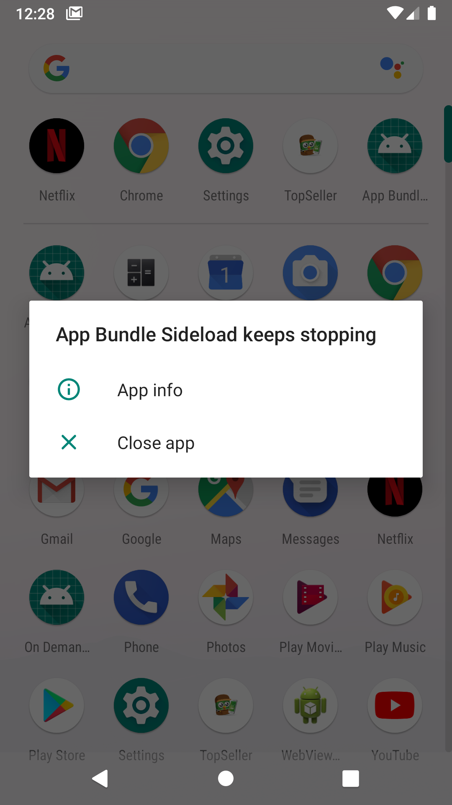
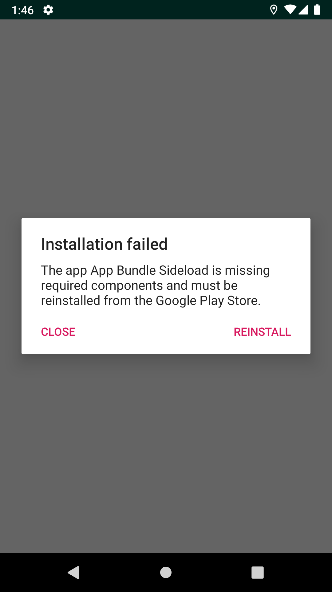
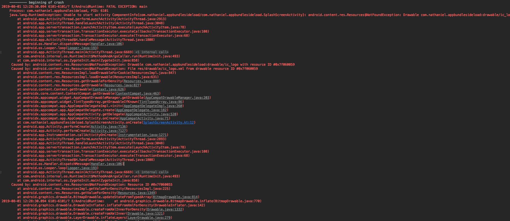
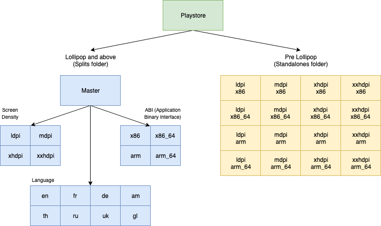

App Bundle Crash Simulation
=====

App bundle is a new publishing format that was introduced in Google I/O 2018. The aim is to reduce the app download size by separating the base and some configuration installations. However, it has a problem with installation from sideloading apk.

This repository has a purpose to simulate the crash from sideloading apk and how to prevent it.

  
  

The Crash Stacktrace
--------

App Bundle Extraction
--------

